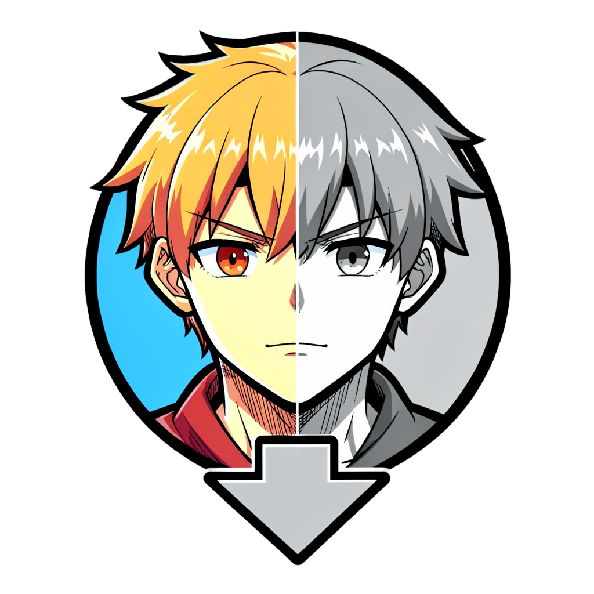
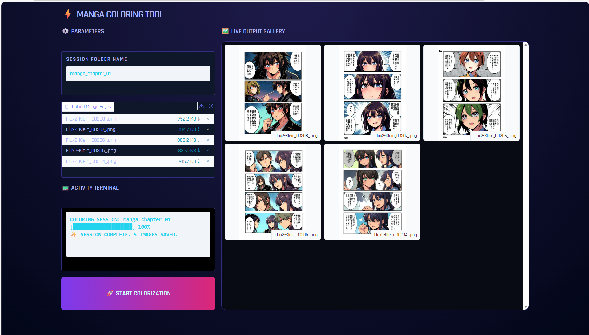
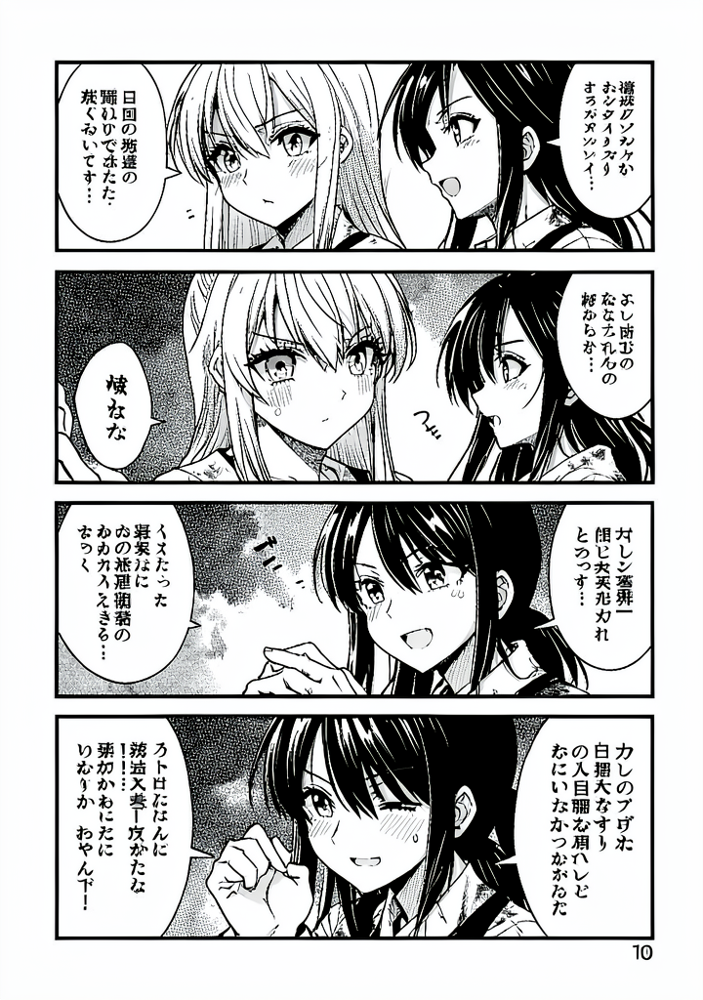
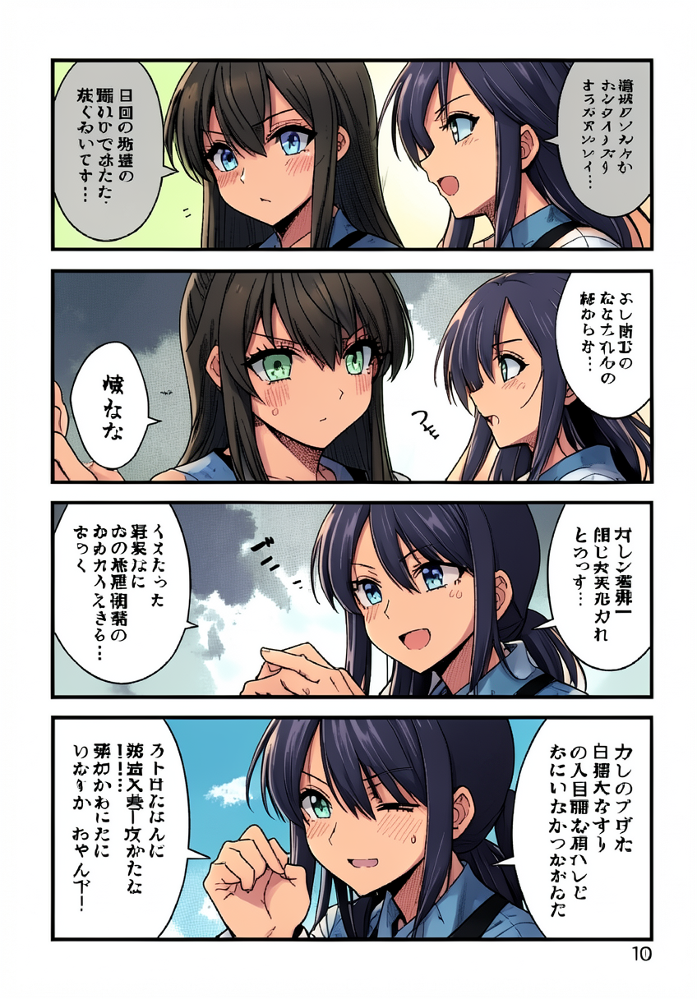
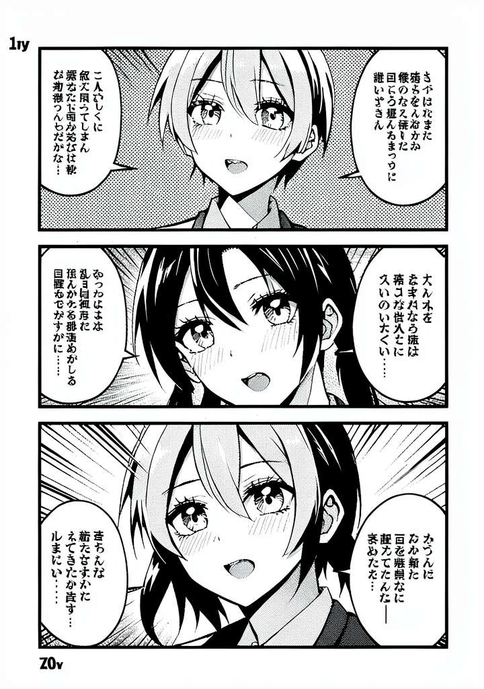
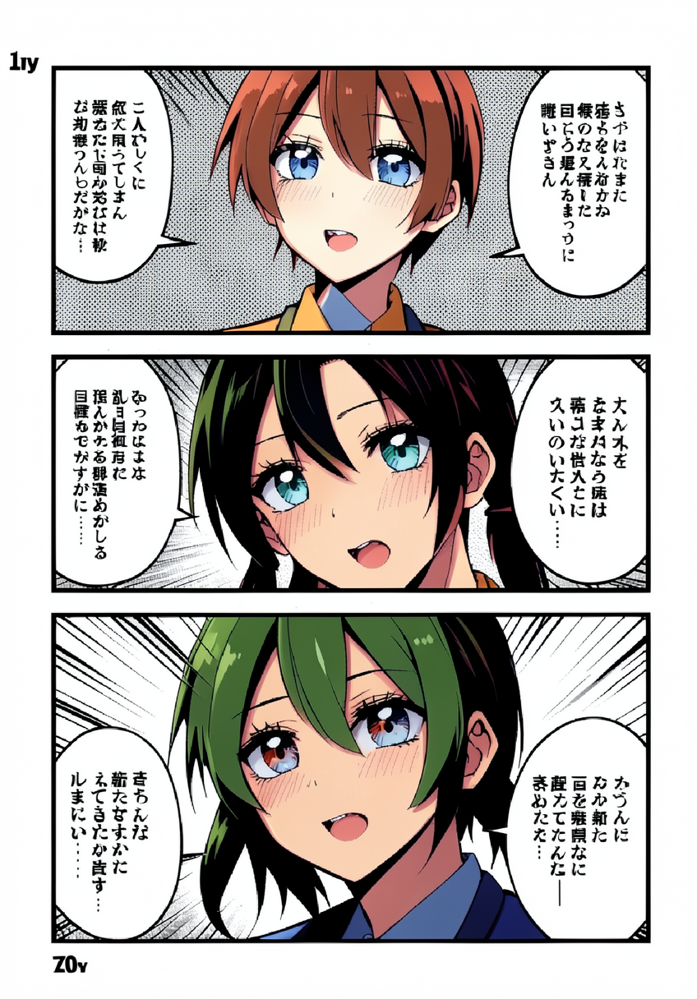
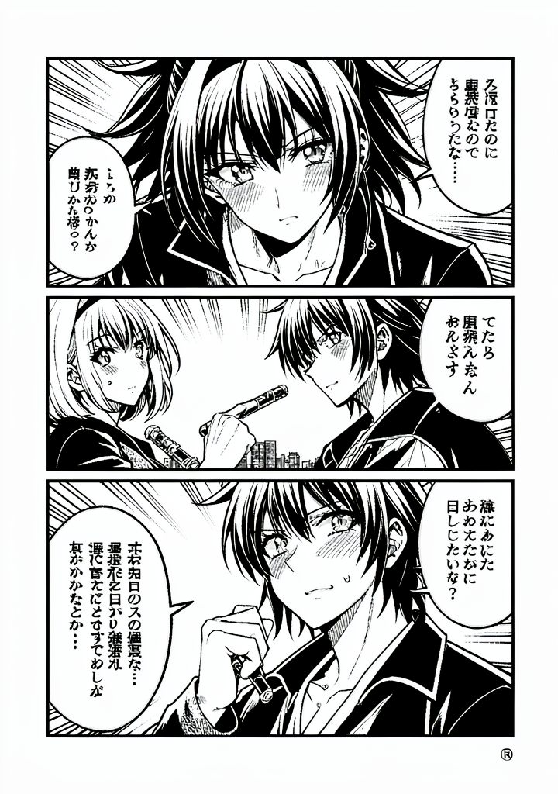
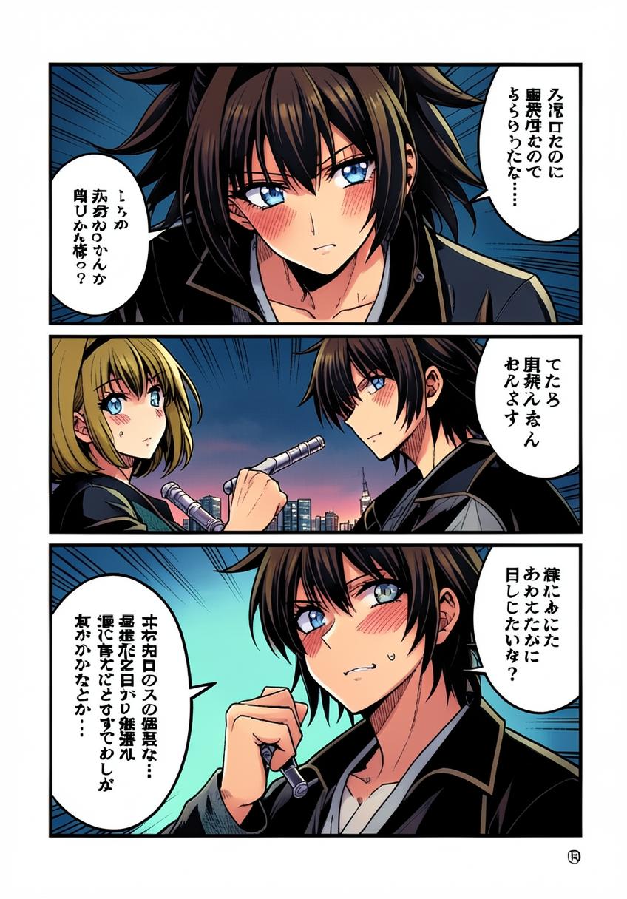

  <h3>Click the logo below to download the program</h3>
  

# 🎨 Manga Colorizer Tool (v1.0 - 2026)

   

The ultimate manga colorizer based on the state-of-the-art **FLUX.2 Klein 4B (FP8)** architecture. This software allows you to transform black and white drawings (lineart) into professionally colored pieces in seconds, optimizing VRAM usage to run smoothly on consumer hardware.

---

## ⚡ Installation and Direct Execution

This project is designed to be portable and easy to use. Follow these steps after unzipping the `.zip` file:

1.  **System Requirements:**
    * **GPU:** NVIDIA (3000 Series or higher recommended) with a minimum of **8GB VRAM**.
    * **Drivers:** Latest NVIDIA Drivers installed. (No need to install CUDA Toolkit manually).
    * **RAM:** 16GB.
    * **Storage:** 15GB free space (for the model and dependencies).

2.  **One-Click Launch!:**
    * Double-click the `run.bat` file.
    * The script will automatically configure the virtual environment (`venv`), install the requirements, and open the interface in your web browser.

---

## 🖥️ Interface Guide and Usage

### 📥 Data Input
* **Main Manga Input:** Upload your B/W image. Works best with clean, well-defined lineart.

### 📤 Output
* The result will appear on the right. You can save the image by right-clicking or using the integrated download button.

---

## 🌟 Results and Capabilities

This software is not just a simple "bucket fill" tool. Thanks to **FLUX.2 Klein**, you will get:
* **Cel-Shading:** Sharp, professional shading typical of modern anime.
* **Detail Preservation:** The original manga screen tones and textures are largely respected and preserved.

---

## 🖼️ Gallery: Before & After

See the power of the engine in action.

| Original Lineart | Colorized Output |
| :---: | :---: |
|  |  |
|  |  |
|  |  |

---

## ❤️ Credits and Open Source Ecosystem

This project is a reality thanks to the open technologies driving AI in 2026:

* **[Black Forest Labs](https://blackforestlabs.ai/):** For developing the revolutionary **FLUX** architecture.
* **[ComfyUI](https://github.com/comfyanonymous/ComfyUI):** Whose innovative memory management and node-based workflow inspired the optimization of this engine for 8GB GPUs.
* **[Hugging Face](https://huggingface.co/):** For facilitating model distribution and the `diffusers` library.
* **[Gradio](https://gradio.app/):** For enabling the creation of powerful and simple interfaces.
* **[Pytorch & NVIDIA](https://pytorch.org/):** For technical support in hardware acceleration (CUDA/FP8).

---

## Future Updates

* **Color References:** You will be able to upload up to **3 reference images**. The system will extract the aesthetic and color palette from these images to apply them coherently to your drawing.

*Developed for the community of artists and manga enthusiasts - 2026.*